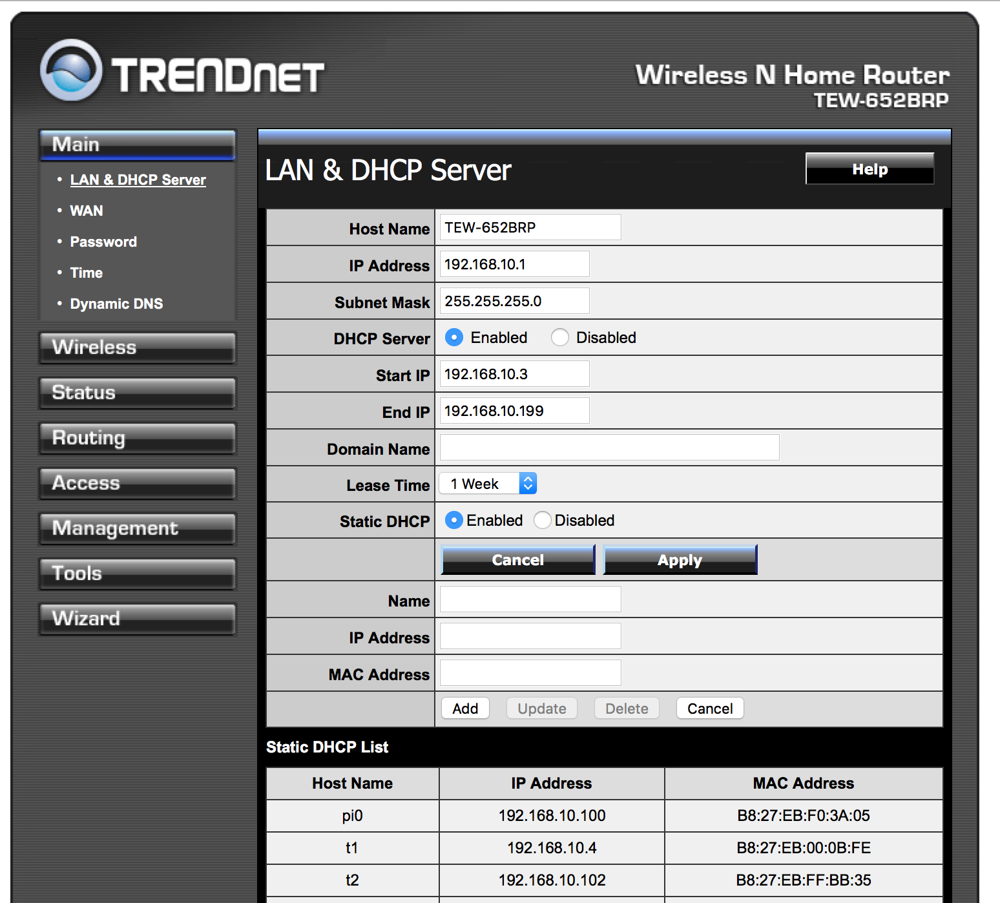

What is pycloud!

pyCloud is a Python as a Service! We use raspberry pi rack to execute the python programs that are written by the users.


## Configuration
### Raspberry Pi Setup
#### Prepare SD card
```sh
# Download kubernetes-on-arm project
$ git clone https://github.com/luxas/kubernetes-on-arm

# Change to that directory
$ cd kubernetes-on-arm

# Write the SD Card, replace 'X' with the real letter
# Replace `rpi-2` with `rpi` if you have an Raspberry Pi 1.
$ sudo sdcard/write.sh /dev/sdX rpi-2 archlinux kube-archlinux

# The installer will ask you if you want to erase all data on your card
# Answer y/n on that question
# Requires an internet connection
# This script runs in 3-4 mins
```
#### Configure RPi

1. Power on your Pi
2. Check the IP address in the router admin page
3. SSH into your Pi [root@ipAddr --> passwd: root]


### Network Setup
Use Ethernet cable to connect Raspberry Pis to a router. Reserve static DHCP for your nodes by using the router setting interface.




Verify the IP address (check eht0 int 192… —> reserved?)
```sh
$ ip addr
```

Install and start userful packages
```sh
$ pacman -Syu vim tmux avahi nss-mdns dialog bash-completion
$ start avahi-demon
$ systemctl enable avahi-daemon.service
$ systemctl start avahi-daemon.service
```
Change the password
```sh
$ passwd —> enter new passed
```
Add the RPi to SSH (because Avahi broadcast its hostname)
```sh
$ vi ~/.ssh/config
Host pi2
Hostname pi2.local
User root

$ ssh-copy-id root@pi2.local
```

#### Build Kubernetes Cluster
This script will install and setup docker, download prebuilt Kubernetes binaries etc. Replace the "NEW_HOSTNAME" to your desired node name.
```sh
# This script runs in 2-3 mins
$ TIMEZONE=America/Los_Angeles SWAP=1 NEW_HOSTNAME=name REBOOT=0 kube-config install
```
If you want to change the hostname/time_zone after the setting:

Change hostname to something meaningful
```sh
$ vi /etc/hostname —> change to desired name
```

Change the Time Zone
```sh
$ timedatectl set-timezone Zone/SubZone
```

##### Setup Kubernetes
To enable the master service
```sh
$ kube-config enable-master
```
To enable the worker service
```sh
# The "enable-worker" script will ask you for the ip of the master
$ kube-config enable-worker
```

## Use Kubernetes
## Use Kubernetes
### Docker
We use `ontouchstart/rpi-ipython-notebook` for the ipython base image. All images used in the cluster **have to be compiled** for `arm`. You can find those images on Docker Hub searching by keywards like: `rpi-` and `arm-`.

Some cool images built for ARM:
- Hypriot: https://hub.docker.com/u/hypriot
- Armbuild: https://hub.docker.com/u/armbuild
- Luxas: https://hub.docker.com/u/luxas

##### Run an Image
This script will spin up a container from the `ontouchstart/rpi-ipython-notebook` image. It maps `port 8000` to `docker port 8888` Browsing to `http://localhost:8000` will connect to `http://dockerIP:8888`
```sh
$ docker run -d -p 8000:8888 -v $(pwd)/home:/home ontouchstart/rpi-ipython-notebook
```
##### User Docker Command
```sh
# list all images
$ docker images
# list all containers
$ docker ps -a
# list running containers
$ docker ps

# Stop all containers
docker stop $(docker ps -a -q)
# Delete all stopped containers (good for clean up)
docker rm $(docker ps -a -q)
# Delete all images
docker rmi $(docker images -q)
```

### Kubernetes
###### Install Kubernetes CLI for Mac
```sh
$ curl -O https://storage.googleapis.com/bin.kuar.io/darwin/kubectl
$ chmod +x kubectl
$ sudo cp kubectl /usr/local/bin/kubectl
```
###### Start service
Create a contaier with three redundancy for failover and opens docker port 8888
```sh
$ kubectl -s http://$MASTER_IP:8080 run my-notebook --image=ontouchstart/rpi-ipython-notebook  --port=8888 --replicas=3
```
Map the docker port 8888 to the service port 80
```sh
$ kubectl -s http://$MASTER_IP:8080 expose rc/my-notebook --port=80
```
Use proxy to listen to api service on port 8080.
```sh
$ kubectl -s http://$MASTER_IP:8080 proxy --port=8080
```
###### Useful Kubernetes Commands
```sh
$ kubectl -s http://$MASTER_IP:8080 cluster-info
$ kubectl -s http://$MASTER_IP:8080 get nodes
$ kubectl -s http://$MASTER_IP:8080 get pods
$ kubectl -s http://$MASTER_IP:8080 get services
$ kubectl -s http://$MASTER_IP:8080 delete rc/$replicationcontrollers-name
$ kubectl -s http://$MASTER_IP:8080 delete svc/$service-name
```

## Test Kubernetes
#### Externally
Open browser and navigate to:
```url
http://$MASTER_IP:8080/api/v1/proxy/namespaces/default/services/my-notebook/
```
#### Internally
Use curl to test the request. Request sent from a node belong to the cluster.
```sh

$ curl -L -i $INTERNAL_IP:8888
$ curl -L -i -H "Accept: application/json" -H "Content-Type: application/json" -X POST -d "{}" $INTERNAL_IP:8888/api/notebooks
```

## Appendix
Special Thanks to `Lucas` and his awesome project!
You can see his helpfulness through our conversation on his GitHub:
- https://github.com/luxas/kubernetes-on-arm/issues/21
- https://github.com/luxas/kubernetes-on-arm/issues/22
